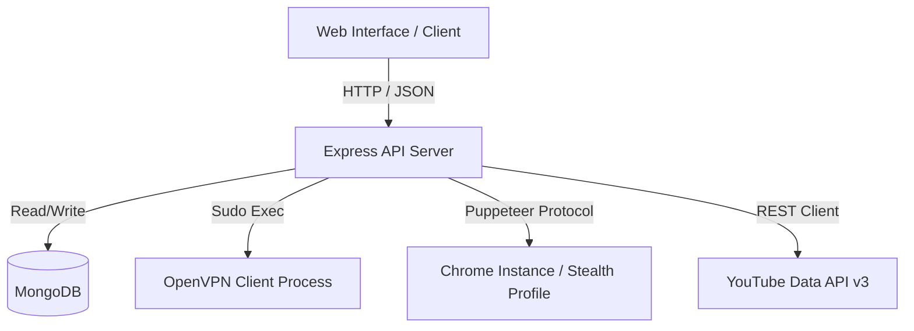

# YouTube Automation API Documentation

This document provides a comprehensive reference guide for all API endpoints, database models, and backend workflows in the YouTube Automation application.

---

## Table of Contents
1. [System Architecture Overview](#system-architecture-overview)
2. [Global Configurations & Security](#global-configurations--security)
3. [Database Schemas](#database-schemas)
4. [API Endpoints Reference](#api-endpoints-reference)
   - [General & System Info](#general--system-info)
   - [Authentication & OAuth Connect](#authentication--oauth-connect)
   - [Google Account Management](#google-account-management)
   - [VPN Config & Control](#vpn-config--control)
   - [YouTube API Services](#youtube-api-services)
   - [Browser Automation (Puppeteer)](#browser-automation-puppeteer)
   - [Comment Automation](#comment-automation)
5. [Error Handling & Responses](#error-handling--responses)

---

## System Architecture Overview

The backend is built with **Node.js, Express, MongoDB (Mongoose), Puppeteer, and OpenVPN**. 



### Key Workflows:
1. **VPN Tunneling per Account**: When operations (like commenting or launching Puppeteer) are executed for a channel, the backend isolates the network traffic by disconnecting any active OpenVPN session, establishing a new connection to the account's assigned `.ovpn` configuration, waiting for the connection to settle, performing the action, and then disconnecting.
2. **Browser Isolation**: Puppeteer browser sessions use a dedicated user data folder `browser_sessions/{googleAccountId}` so that cookies, local storage, and login sessions are kept isolated.

---

## Global Configurations & Security

- **Base URL**: `http://localhost:5000` (or `PORT` defined in `.env`)
- **Authentication**: JWT-based. Protected routes require the `Authorization` header with a Bearer token:
  ```http
  Authorization: Bearer <JWT_TOKEN>
  ```
- **Token Encrypted Storage**: Access tokens and refresh tokens for connected Google accounts are encrypted using AES-256 before being stored in MongoDB to secure credential storage.

---

## Database Schemas

### 1. User
Represents a dashboard administrator/user logged in through Google authentication.
* **File Reference**: [User.js](file:///Users/macbook/Documents/Backup/yt_automation/src/models/User.js)
```javascript
{
  googleId: String (required, unique),
  email: String (required, unique),
  name: String (required),
  avatar: String,
  createdAt: Date,
  updatedAt: Date
}
```

### 2. GoogleAccount
Represents a connected Google account (YouTube channel) used for automated uploading or commenting.
* **File Reference**: [GoogleAccount.js](file:///Users/macbook/Documents/Backup/yt_automation/src/models/GoogleAccount.js)
```javascript
{
  user: ObjectId (ref: 'User', required),
  googleId: String (required),
  email: String (required),
  name: String (required),
  avatar: String,
  accessToken: String (encrypted, required),
  refreshToken: String (encrypted),
  isActive: Boolean (default: false),
  status: String (enum: ['connected', 'disconnected'], default: 'connected'),
  browserSessionDir: String (default: null),
  createdAt: Date,
  updatedAt: Date
}
// Compound Index: { user: 1, googleId: 1 } (unique)
```

### 3. VpnProfile
Stores VPN configuration associations and execution state for a connected Google Account.
* **File Reference**: [VpnProfile.js](file:///Users/macbook/Documents/Backup/yt_automation/src/models/VpnProfile.js)
```javascript
{
  googleAccount: ObjectId (ref: 'GoogleAccount', required, unique),
  user: ObjectId (ref: 'User', required),
  configFileName: String (required),  // Stored name, e.g. "{googleAccountId}.ovpn"
  originalFileName: String (required), // Uploaded name, e.g. "germany_node1.ovpn"
  configPath: String (required),       // Absolute file path
  serverLocation: String (default: ''),
  isConnected: Boolean (default: false),
  pid: Number (default: null),         // Daemon process ID
  assignedAt: Date (default: Date.now),
  createdAt: Date,
  updatedAt: Date
}
```

---

## API Endpoints Reference

### General & System Info

#### 1. API Health Check
* **Route**: `GET /api/health`
* **Auth Required**: No
* **Description**: Verifies if the backend server is running.
* **Success Response**: `200 OK`
  ```json
  {
    "message": "API is running"
  }
  ```

#### 2. Get Google Client Config
* **Route**: `GET /api/config/client`
* **Auth Required**: No
* **Description**: Exposes the Google Client ID configured on the backend for frontend SDK initialization.
* **Success Response**: `200 OK`
  ```json
  {
    "googleClientId": "1234567890-abcdef.apps.googleusercontent.com"
  }
  ```

---

### Authentication & OAuth Connect

#### 1. Google Login (Dashboard Access)
* **Route**: `POST /api/auth/google`
* **Auth Required**: No
* **Description**: Registers or logs in a dashboard user using their Google identity details.
* **Request Body**:
  ```json
  {
    "googleId": "10987654321",
    "email": "admin@example.com",
    "name": "Alex Admin",
    "avatar": "https://example.com/avatar.png"
  }
  ```
* **Success Response**: `200 OK`
  ```json
  {
    "_id": "60d0fe4f5311236168a109a1",
    "name": "Alex Admin",
    "email": "admin@example.com",
    "avatar": "https://example.com/avatar.png",
    "token": "eyJhbGciOiJIUzI1NiIsInR5..."
  }
  ```

#### 2. Connect Google Account (YouTube Connection)
* **Route**: `POST /api/auth/google/connect`
* **Auth Required**: Yes
* **Description**: Exchanges a Google Authorization Code for access and refresh tokens, fetches userinfo, links it to the logged-in dashboard user, and automatically assigns a VPN config from the unused server pool.
* **Request Body**:
  ```json
  {
    "code": "4/0AdQt8qj...",
    "tempVpnProfileId": "60d0fe4f5311236168a109a9" // Optional: ID of a pre-connected VPN config
  }
  ```
* **Technical Flow**:
  1. If `tempVpnProfileId` is provided, links the account to that pre-connected VPN.
  2. Otherwise, scans the `serverListTCP/` pool, selects a random unused `.ovpn` file, copies it to `uploads/ovpn/{tempId}.ovpn`, creates a profile, and connects to it.
  3. Uses the VPN connection to query Google's token endpoint and exchanges the `code`.
  4. Encrypts access and refresh tokens and creates/updates the `GoogleAccount` document.
  5. Updates the `VpnProfile` database relationship and renames the file to `{accountId}.ovpn`.
  6. Disconnects the active VPN connection to restore normal server network routing.
* **Success Response**: `201 Created` (or `200 OK` if already exists)
  ```json
  {
    "message": "Account connected successfully and VPN auto-assigned",
    "accountId": "60d0fe4f5311236168a109ab",
    "email": "channel@example.com",
    "name": "Gaming Vlog Channel",
    "isActive": true,
    "needsVpnConfig": false,
    "vpn": {
      "originalFileName": "usa-chicago.ovpn",
      "serverLocation": "USA Chicago"
    }
  }
  ```

---

### Google Account Management

#### 1. List Connected Accounts
* **Route**: `GET /api/google-accounts`
* **Auth Required**: Yes
* **Description**: Fetches all connected Google accounts owned by the authenticated user, complete with their assigned VPN status and current connection status. Security: Tokens are excluded from results.
* **Success Response**: `200 OK`
  ```json
  [
    {
      "_id": "60d0fe4f5311236168a109ab",
      "user": "60d0fe4f5311236168a109a1",
      "googleId": "1234567890",
      "email": "channel@example.com",
      "name": "Gaming Vlog Channel",
      "avatar": "https://example.com/avatar.png",
      "isActive": true,
      "status": "connected",
      "vpn": {
        "hasVpnConfig": true,
        "originalFileName": "usa-chicago.ovpn",
        "serverLocation": "USA Chicago",
        "isVpnConnected": false
      },
      "createdAt": "2026-06-15T00:00:00.000Z",
      "updatedAt": "2026-06-15T00:05:00.000Z"
    }
  ]
  ```

#### 2. Add Account Manually
* **Route**: `POST /api/google-accounts`
* **Auth Required**: Yes
* **Description**: Manually registers/adds a Google account connection on the backend (tokens are encrypted on creation).
* **Request Body**:
  ```json
  {
    "googleId": "1234567890",
    "email": "manually_added@example.com",
    "name": "Manual Channel",
    "avatar": "https://example.com/avatar.png",
    "accessToken": "ya29.a0AfB...",
    "refreshToken": "1//0ea..."
  }
  ```
* **Success Response**: `201 Created`
  ```json
  {
    "message": "Account added successfully",
    "accountId": "60d0fe4f5311236168a109bf",
    "isActive": false
  }
  ```

#### 3. Upload VPN Configuration File
* **Route**: `POST /api/google-accounts/:id/vpn-config`
* **Auth Required**: Yes
* **Content-Type**: `multipart/form-data`
* **Description**: Uploads a custom OpenVPN config file (`.ovpn`) to associate with a Google Account.
* **Form-data Fields**:
  - `ovpnFile` (Binary File, Required): The `.ovpn` configuration file. Max 5MB.
* **Success Response**: `200 OK`
  ```json
  {
    "message": "VPN config uploaded successfully",
    "vpn": {
      "originalFileName": "germany-berlin.ovpn",
      "serverLocation": "Germany Berlin",
      "isConnected": false
    }
  }
  ```

#### 4. Set Active Google Account
* **Route**: `PUT /api/google-accounts/:id/active`
* **Auth Required**: Yes
* **Description**: Marks a specific channel as active. This disconnects any running VPN connection and connects to the selected account's assigned VPN.
* **Success Response**: `200 OK`
  ```json
  {
    "message": "Active account updated",
    "accountId": "60d0fe4f5311236168a109ab",
    "vpn": {
      "serverLocation": "USA Chicago",
      "originalFileName": "usa-chicago.ovpn",
      "isConnected": true
    }
  }
  ```

#### 5. Remove Connected Google Account
* **Route**: `DELETE /api/google-accounts/:id`
* **Auth Required**: Yes
* **Description**: Deletes a connected Google account, cleans up and removes its stored `.ovpn` file, stops its OpenVPN daemon, and deletes the associated `VpnProfile`. If the removed account was active, another connected account is automatically set active and its VPN starts.
* **Success Response**: `200 OK`
  ```json
  {
    "message": "Account removed successfully",
    "id": "60d0fe4f5311236168a109ab"
  }
  ```

---

### VPN Config & Control

#### 1. Get VPN Status
* **Route**: `GET /api/vpn/status`
* **Auth Required**: Yes
* **Description**: Returns the operational status of OpenVPN on the server, lists active PIDs, and displays external geodata (ISP, country, city) fetched from `ip-api.com`. It also retrieves database details for the currently active VPN Profile.
* **Success Response**: `200 OK`
  ```json
  {
    "isVpnActive": true,
    "activePids": [10482],
    "publicIp": "82.102.23.45",
    "country": "Germany",
    "city": "Berlin",
    "isp": "M247 Ltd",
    "connectedProfile": {
      "originalFileName": "germany-berlin.ovpn",
      "serverLocation": "Germany Berlin",
      "googleAccount": {
        "_id": "60d0fe4f5311236168a109bf",
        "email": "manually_added@example.com",
        "name": "Manual Channel"
      }
    }
  }
  ```

#### 2. Connect VPN Manually
* **Route**: `POST /api/vpn/connect/:googleAccountId`
* **Auth Required**: Yes
* **Description**: Disconnects any active VPN tunnels, then starts a new OpenVPN daemon background process using the config mapped to the requested `googleAccountId`.
* **Success Response**: `200 OK`
  ```json
  {
    "message": "VPN connected successfully",
    "originalFileName": "germany-berlin.ovpn",
    "serverLocation": "Germany Berlin"
  }
  ```

#### 3. Disconnect VPN Manually
* **Route**: `POST /api/vpn/disconnect`
* **Auth Required**: Yes
* **Description**: Sends a kill command (`sudo killall openvpn`) to disconnect all running OpenVPN instances and updates all `VpnProfile` documents status.
* **Success Response**: `200 OK`
  ```json
  {
    "message": "VPN disconnected successfully"
  }
  ```

#### 4. Pre-connect to a Pool VPN
* **Route**: `POST /api/vpn/pre-connect`
* **Auth Required**: Yes
* **Description**: Selects an unused VPN configuration from the local pool, copies it, and connects to it, returning a temporary `VpnProfile` ID. Used in onboarding to establish a secure tunnel before starting the Google login flow.
* **Request Body**:
  ```json
  {
    "vpnFile": "germany-berlin.ovpn" // Optional: Specific filename to connect to. If empty, a random unused one is chosen.
  }
  ```
* **Success Response**: `200 OK`
  ```json
  {
    "message": "VPN pre-connected successfully",
    "tempVpnProfileId": "60d0fe4f5311236168a109a9",
    "serverLocation": "Germany Berlin",
    "originalFileName": "germany-berlin.ovpn"
  }
  ```

#### 5. List Assigned Configs
* **Route**: `GET /api/vpn/configs/assigned`
* **Auth Required**: Yes
* **Description**: Fetches all `VpnProfile` configuration mappings associated with the current user.
* **Success Response**: `200 OK`

#### 6. List Pool Config Files
* **Route**: `GET /api/vpn/configs/pool`
* **Auth Required**: Yes
* **Description**: Lists all filenames ending in `.ovpn` inside the local `serverListTCP/` directory.
* **Success Response**: `200 OK`
  ```json
  [
    "uk-london.ovpn",
    "usa-chicago.ovpn",
    "germany-berlin.ovpn"
  ]
  ```

---

### YouTube API Services

All YouTube APIs operate on the **currently active** Google account of the logged-in dashboard user.

#### 1. Get Channel Stats
* **Route**: `GET /api/youtube/stats`
* **Auth Required**: Yes
* **Description**: Fetches YouTube channel information and stats (Subscriber Count, Total Views, Video Count, Name, Thumbnail) via the Google YouTube v3 API using the decrypted active account tokens.
* **Success Response**: `200 OK`
  ```json
  {
    "channelId": "UC...",
    "title": "Gaming Vlog Channel",
    "subscriberCount": 42000,
    "viewCount": 1500000,
    "videoCount": 184,
    "thumbnail": "https://yt3.ggpht.com/..."
  }
  ```

#### 2. Upload Video
* **Route**: `POST /api/youtube/upload`
* **Auth Required**: Yes
* **Content-Type**: `multipart/form-data`
* **Description**: Uploads a video file to the active YouTube channel.
* **Form-data Fields**:
  - `video` (Binary File, Required): The video file upload.
  - `title` (String, Optional): Title of the video.
  - `description` (String, Optional): Description of the video.
  - `tags` (String, Optional): Comma-separated list of tags.
  - `privacyStatus` (String, Optional): Options are `private` (default), `unlisted`, or `public`.
* **Technical Flow**:
  1. Saves the file to `uploads/` temporarily via Multer.
  2. Retrieves active channel's decrypted tokens.
  3. Uploads the video file stream to YouTube's chunked upload API.
  4. Deletes the temporary file from the disk.
* **Success Response**: `200 OK`
  ```json
  {
    "message": "Video uploaded successfully",
    "videoId": "xT3bA_8rF7",
    "url": "https://youtu.be/xT3bA_8rF7",
    "data": { ... }
  }
  ```

---

### Browser Automation (Puppeteer)

Puppeteer operations run a headless/headful browser session connected to a specific Google account and routed through that account's specific VPN tunnel.

#### 1. Launch/Reuse Browser
* **Route**: `POST /api/browser/launch/:googleAccountId`
* **Auth Required**: Yes
* **Description**: Connects to the account's VPN config (if assigned), then launches a Puppeteer instance. If an instance is already running for the account, it yields it without launching a new window.
* **Success Response**: `200 OK`
  ```json
  {
    "message": "Browser launched for channel@example.com.",
    "accountId": "60d0fe4f5311236168a109ab",
    "email": "channel@example.com",
    "status": "open",
    "reused": false,
    "vpn": {
      "assigned": true,
      "location": "USA Chicago",
      "file": "usa-chicago.ovpn"
    }
  }
  ```

#### 2. List Browser Status
* **Route**: `GET /api/browser/status`
* **Auth Required**: Yes
* **Description**: Lists all currently active browser instances on the server.
* **Success Response**: `200 OK`
  ```json
  {
    "total": 1,
    "sessions": [
      {
        "accountId": "60d0fe4f5311236168a109ab",
        "email": "channel@example.com",
        "vpnFile": "usa-chicago.ovpn",
        "vpnLocation": "USA Chicago"
      }
    ]
  }
  ```

#### 3. Close Browser Session
* **Route**: `POST /api/browser/close/:googleAccountId`
* **Auth Required**: Yes
* **Description**: Closes the browser window for the specified account and terminates its associated VPN daemon process.
* **Success Response**: `200 OK`
  ```json
  {
    "message": "Browser session closed for channel@example.com.",
    "accountId": "60d0fe4f5311236168a109ab"
  }
  ```

#### 4. Close All Browsers
* **Route**: `POST /api/browser/close-all`
* **Auth Required**: Yes
* **Description**: Closes all active browser processes and terminates all OpenVPN instances.
* **Success Response**: `200 OK`
  ```json
  {
    "message": "All browser sessions closed and VPNs disconnected."
  }
  ```

#### 5. List Available Tasks
* **Route**: `GET /api/browser/tasks`
* **Auth Required**: Yes
* **Description**: Returns a list of pre-configured automated scripts that can be run inside browser windows.
* **Success Response**: `200 OK`
  ```json
  {
    "tasks": [
      "get-current-ip",
      "youtube-login-check",
      "youtube-studio-snapshot",
      "screenshot"
    ]
  }
  ```

#### 6. Execute Browser Task
* **Route**: `POST /api/browser/run-task/:googleAccountId`
* **Auth Required**: Yes
* **Request Body**:
  ```json
  {
    "task": "youtube-login-check"
  }
  ```
* **Registered Tasks Summary**:
  * `get-current-ip`: Navigates to `ipify.org` and parses the current outbound IP. Useful for testing VPN configs.
  * `youtube-login-check`: Navigates to YouTube and verifies if the user is authenticated, retrieving the channel name if signed in.
  * `youtube-studio-snapshot`: Opens YouTube Studio, waits for analytics, and validates login.
  * `screenshot`: Captures a full-screen image and saves it to the session data directory.
* **Success Response**: `200 OK`
  ```json
  {
    "message": "Task \"youtube-login-check\" completed for channel@example.com.",
    "accountId": "60d0fe4f5311236168a109ab",
    "email": "channel@example.com",
    "task": "youtube-login-check",
    "result": {
      "loggedIn": true,
      "channelName": "Gaming Vlog Channel"
    }
  }
  ```

---

### Comment Automation

#### 1. Post Batch Comments
* **Route**: `POST /api/comments/post`
* **Auth Required**: Yes
* **Description**: Posts comments on a YouTube video from multiple connected Google Accounts, cycling VPN connections between channels.
* **Request Body (Customized Comments per Account)**:
  ```json
  {
    "videoUrl": "https://www.youtube.com/watch?v=dQw4w9WgXcQ",
    "accountComments": {
      "60d0fe4f5311236168a109ab": "Awesome content, loved the gaming review!",
      "60d0fe4f5311236168a109bf": "Great quality. Keep uploading!"
    }
  }
  ```
* **Request Body (Generic Comment Pool Fallback)**:
  ```json
  {
    "videoUrl": "https://www.youtube.com/watch?v=dQw4w9WgXcQ",
    "comments": [
      "Check this out!",
      "Subscribed to your channel!",
      "Amazing video!"
    ]
  }
  ```
* **Technical Flow**:
  1. Extract YouTube Video ID from URL.
  2. Parse targeted accounts.
  3. Loop through each account:
     - Disconnect existing VPN tunnels.
     - Connect to the account's assigned VPN.
     - Access YouTube API and insert comment using decrypted account tokens.
     - Log success/failure status.
     - Disconnect VPN.
     - Pause for a randomized delay (2 to 5 seconds) before proceeding to the next account to prevent spam detection.
* **Success Response**: `200 OK`
  ```json
  {
    "message": "Commenting complete. 2 succeeded, 0 failed.",
    "videoId": "dQw4w9WgXcQ",
    "total": 2,
    "successful": 2,
    "failed": 0,
    "results": [
      {
        "accountId": "60d0fe4f5311236168a109ab",
        "email": "channel@example.com",
        "name": "Gaming Vlog Channel",
        "comment": "Awesome content, loved the gaming review!",
        "status": "success"
      },
      {
        "accountId": "60d0fe4f5311236168a109bf",
        "email": "manually_added@example.com",
        "name": "Manual Channel",
        "comment": "Great quality. Keep uploading!",
        "status": "success"
      }
    ]
  }
  ```

---

## Error Handling & Responses

The backend features a global Express error handler. In the event of a failure, it adjusts status code appropriately and returns a structured JSON payload containing a descriptive error message.

### Error Response Format
```json
{
  "message": "Error description text here",
  "stack": "Stack trace details... (Null in production mode)"
}
```

### Common Status Codes
- `400 Bad Request`: Missing required request body parameters or invalid input format.
- `401 Unauthorized`: Missing or failed Bearer JWT authorization token.
- `404 Not Found`: Request route, user, account, or VPN profile not found.
- `500 Internal Server Error`: Server-side processing failures (e.g. OpenVPN failing to bind, YouTube API quota limits, network timeouts).
